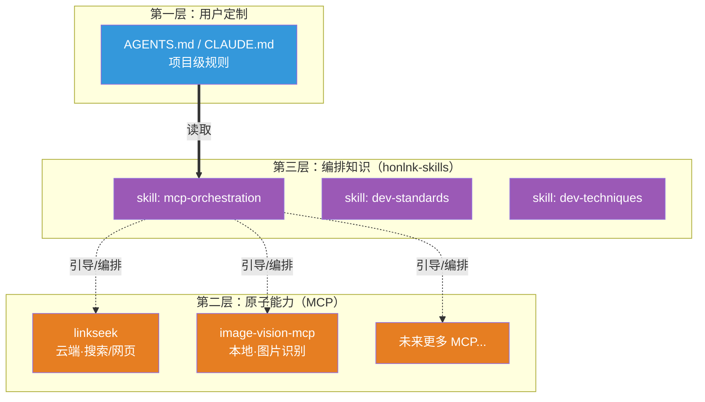

---
tags:
  - Skills
  - MCP
  - AI工具
  - 个人生态
  - 方案规划
aliases:
  - honlnk-skills
  - 个人 Skills 合集
  - Skills 计划
date: 2026-07-22
status: draft
type: 方案规划
---

# honlnk-skills：个人 Skills 合集计划

> [!abstract] 定位
> `honlnk-skills` 是作者个人生产力 Skills 合集的开源仓库，作为 **linkseek（云端 MCP）+ 图片识别 MCP（本地 MCP）** 之上的**第三层**，承载跨工具编排知识、开发规范、个人工作流。采用「**一个仓库，多个独立 skill**」结构。

> [!quote] 背景
> 随着自研 MCP 工具逐渐增多（[[web-fetch-mcp-server-design|linkseek]]、[[picsense-design|picsense]]），一个编排问题浮现：如何让 Agent 知道「这些工具可以组合使用」「什么场景该组合」？答案是 Skills——它能被 Agent 在运行时自动加载，而不需要用户手写协作规则。详见 [[picsense-design]] §1.2 的三层模型。

## 一、为什么需要 honlnk-skills

### 1.1 问题：MCP 提供能力，但不会告诉 Agent 如何编排

MCP 是**原子能力的提供者**，但 MCP 工具描述（tool description）受限于篇幅，只能描述单个工具「做什么」，无法承载「多个工具如何协作」这类跨工具的编排知识。

如果只靠 README + AGENTS.md，存在两个断点：

```text
README（给人看）          AGENTS.md（Agent 每次启动读）
    ↓ 被动阅读                ↓ 用户手写
用户读到 workflow 示例     用户得自己理解 + 手写协作规则
    ↓                          ↓
断点1：用户可能没读到      断点2：每个用户都要重写一遍
```

### 1.2 Skills 补上缺失的中间层

Anthropic 的 Agent Skills 是一种**运行时自动加载**的渐进式知识载体。它的核心优势是 **progressive disclosure（渐进披露）**：

| 层级 | 何时加载 | token 成本 | 内容 |
|------|---------|-----------|------|
| **Level 1: Metadata** | 始终（启动时） | ~100 tokens/skill | YAML frontmatter 的 `name` + `description` |
| **Level 2: Instructions** | Skill 被触发时 | < 5k tokens | SKILL.md 正文 |
| **Level 3: Resources** | 按需 | 访问前为零 | 捆绑的参考文件、脚本 |

这意味着：**装很多 skill 不会拖累上下文**——未被触发的 skill 只占 name + description 的几十个 token。

> [!tip] 关键优势
> Skills 由 Agent 根据 task **自动判断是否加载**，不需要用户在每次对话里手动提醒，也不需要用户把协作规则抄进 AGENTS.md。

## 二、三层模型：honlnk 生态的职责分层



| 层 | 受众 | 何时起作用 | 放什么 |
|---|---|---|---|
| **README** | 人在 GitHub 浏览时 | 被动阅读 | 每个 MCP 是什么、怎么装、独立能力 |
| **Skills**（honlnk-skills） | Agent 运行时 | **自动加载**（靠 description 触发） | 跨工具编排、何时组合、workflow 范式 |
| **AGENTS.md** | 用户自己的项目 | Agent 每次启动读 | 用户私有定制、项目级规则 |

> [!important] 耦合问题的干净解法
> 两个 MCP **本身零耦合**：各自独立安装、独立工作。honlnk-skills 是独立的第三层，只承载「当同时拥有这两个工具时，如何组合」的编排知识。
> - 没有 linkseek 的用户，image MCP 照样能用
> - 没有 image MCP 的用户，linkseek 照样能用
> - 装了 skill 但缺某个 MCP？skill 里可引导用户去配置
>
> **MCP 提供原子能力，Skills 提供组合范式**——职责分得很干净。

## 三、仓库结构：方案 A（一仓多 skill）

```text
honlnk-skills/
├── README.md                        # 合集总览 + 安装说明
├── skills/
│   ├── mcp-orchestration/           # 跨 MCP 编排（linkseek + image MCP 协作）
│   │   ├── SKILL.md
│   │   └── workflows/               # 典型 workflow 范式
│   │       ├── research-with-images.md   # 「联网搜资料 + 识别文中配图」
│   │       └── ...
│   ├── dev-standards/               # 开发规范（提交规范、分支策略、命名约定）
│   │   ├── SKILL.md
│   │   └── reference/
│   │       └── commit-conventions.md
│   ├── dev-techniques/              # 开发技巧 / 经验沉淀
│   │   └── SKILL.md
│   └── ...                          # 未来按主题扩展
└── LICENSE
```

### 3.1 为什么选「一仓多 skill」而非「每 skill 独立仓」

| 维度 | 方案 A：一仓多 skill ✅ | 方案 B：每 skill 独立仓 |
|------|----------------------|----------------------|
| **安装** | clone 一个仓即得全部 | 用户按需逐个安装 |
| **skill 间引用** | `[[dev-standards]]` 可直接双向链接 | 跨仓引用复杂 |
| **主题一致性** | 统一品牌「honlnk-skills」 | 分散 |
| **管理成本** | 一个仓维护 | N 个仓维护 |
| **粒度** | Agent 仍按单个 skill 的 description 自动加载——**粒度在运行时依然是最细的** | 最细 |
| **适用场景** | 个人 / 小团队生产力合集 | 大型组织、独立分发 |

**核心论据**：方案 A 的「粗粒度安装」与运行时「细粒度加载」**互不冲突**——用户装一个仓拿全部 skill，但 Agent 只在 relevant 时加载对应 skill（靠 Level 1 metadata 的 description 匹配）。一个纯图片识别任务不会触发 `dev-standards` skill。

## 四、SKILL.md 规范（基于 Anthropic 官方）

### 4.1 frontmatter 要求

```yaml
---
name: skill-name-in-kebab-case
description: 这个 skill 做什么 + 什么场景触发。description 是 Agent 唯一发现依据，必须同时写清「能力」和「触发时机」。
---
```

| 字段 | 约束 |
|------|------|
| `name` | 最多 64 字符，仅小写字母 + 数字 + 连字符，禁 XML 标签，禁保留词 `anthropic` / `claude` |
| `description` | 非空，最多 1024 字符，禁 XML 标签。**必须包含「做什么」+「何时用」** |

### 4.2 SKILL.md 正文结构

```markdown
# Skill 名称

## 适用场景
[什么任务会用到这个 skill]

## 指南 / Workflow
[步骤化指引，Claude 会按此执行]

## 示例
[具体调用范例]
```

### 4.3 三个层级的渐进披露策略

| 层级 | honlnk-skills 的用法 |
|------|---------------------|
| **L1 Metadata** | 每个 skill 的 description 写清「这是 honlnk 生态的 XX 编排能力，当用户同时使用 YY + ZZ 工具时触发」 |
| **L2 Instructions** | SKILL.md 正文写编排范式、调用顺序、判断逻辑 |
| **L3 Resources** | `workflows/` 放典型场景的详细 workflow 范式，按需加载 |

## 五、首批 skill 规划

> [!warning] 时机
> honlnk-skills 的首个 skill（`mcp-orchestration`）**在图片识别 MCP 落地后**才启动详细设计。现阶段只做规划，不写 SKILL.md 正文。

### 5.1 `mcp-orchestration`（首批·核心）

**定位**：linkseek + 图片识别 MCP 的跨工具编排知识。

**预期 description 方向**：
> 当用户任务同时涉及「联网搜索/获取网页内容」与「图片/视觉识别」时使用。指导 Agent 先用 linkseek 获取网页文字、识别文中配图 URL，再用图片识别 MCP 识别图片内容，综合文字 + 视觉信息回答。

**典型 workflow**（已在 [[picsense-design]] §1.2 提及）：
```text
用户："分析这篇文章里这张架构图的设计是否合理"
  ↓ Agent 自主编排
1. linkseek.web_fetch → 拿文章正文
2. 从正文中识别出架构图 URL
3. image-vision-mcp.analyze_image → 识别该图
4. 综合文字 + 图片信息回答
```

### 5.2 `dev-standards`（后续）

作者的开发规范沉淀：提交规范、分支策略、命名约定等。

### 5.3 `dev-techniques`（后续）

开发技巧 / 经验沉淀：可复用的工作方法、踩坑总结等。

### 5.4 未来扩展

- 更多 MCP 之间的协作编排（随着新 MCP 增加而扩展）
- 项目脚手架 / 模板引导
- 个人工作流自动化

## 六、分发与安装方式

### 6.1 Claude Code

```bash
# Claude Code skills 放在 ~/.claude/skills/（个人）或 .claude/skills/（项目）
# 可以 git submodule 或 clone 的方式接入
git clone https://github.com/honlnk/honlnk-skills ~/.claude/skills/honlnk-skills
```

### 6.2 跨 Agent 适配（待研究）

不同 Agent 对 skills 的发现机制可能不同（ZCode、OpenCode、Codex 等），需要逐一调研。现阶段以 Claude Code / ZCode 为主要适配目标。

> [!note] 官方约束提醒
> Claude API 上的 Skills 运行在**沙箱容器**，**无网络访问、不能运行时装包**。但 Claude Code / ZCode 这类本地 Agent 有完整网络和文件系统访问——honlnk-skills 主要面向本地 Agent 场景，不受 API 沙箱约束。

## 七、与两个 MCP 项目的关系

```text
linkseek（云端 MCP）──┐
                      ├── honlnk-skills（编排层，引用但不依赖）
image-vision-mcp ────┘          │
（本地 MCP）                    │
                                ↓
                        Agent 运行时自动加载
```

| 原则 | 说明 |
|------|------|
| **skills 引用但不依赖 MCP** | skill 内容会写「当有 linkseek 时如何配合」，但不强制要求 MCP 存在 |
| **MCP 不感知 skills** | MCP 工具描述里**不写**「请配合 honlnk-skills 使用」——保持 MCP 的单一职责 |
| **缺失检测** | skill 里可写「调用前先判断 MCP 是否已配置，若否则提示用户配置」（具体实现待定，可能更适合做成 command） |

## 八、后续讨论清单（待 MCP 落地后启动）

> [!important] 时机声明
> 本节在图片识别 MCP **开发完成并开源后**才启动讨论。现阶段 skills 只是规划，不在 MCP 开发前做。

### 结构与命名

- [ ] 仓库名最终确认（`honlnk-skills`？还是其他？）
- [ ] skill 命名规范（`mcp-orchestration` 是否合适？要不要加 `honlnk-` 前缀？）
- [ ] 目录结构是否需要调整（`workflows/` 子目录是否必要？）

### 首批 skill 内容

- [ ] `mcp-orchestration` 的 description 最终定稿
- [ ] 列出 linkseek + image MCP 的全部典型组合场景
- [ ] 每个 workflow 范式的详细编写

### 分发与安装

- [ ] Claude Code / ZCode 的具体接入方式（git submodule？symlink？插件机制？）
- [ ] 其他 Agent（OpenCode / Codex）的 skills 发现机制调研
- [ ] 是否需要提供安装脚本

### 引导用户配置 MCP

- [ ] 「检测 MCP 是否已配置」的实现方式（skill 内判断 vs 独立 command）
- [ ] 若做成 command，命名与触发方式（`/setup-honlnk-tools`？）

### 扩展规划

- [ ] `dev-standards` / `dev-techniques` 的内容边界
- [ ] 是否需要 monorepo 统一管理 skills + 两个 MCP

---

## 修订记录

- 2026-07-22：初稿，确立三层模型 + 方案 A 结构 + 首批 skill 规划。skills 详细设计延后至图片识别 MCP 落地后。
