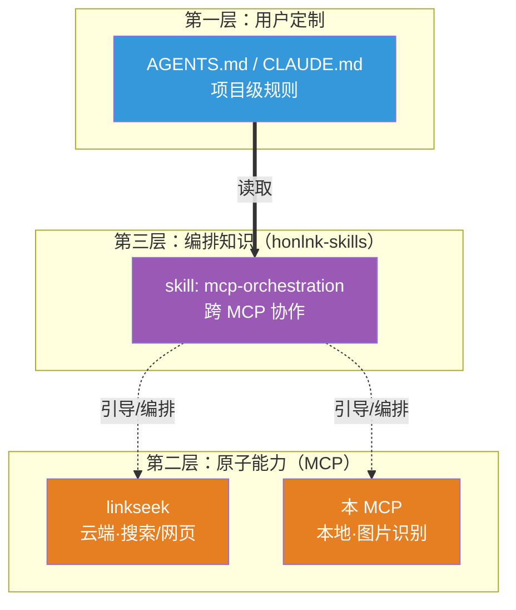

---
tags:
  - MCP
  - AI工具
  - 图片识别
  - 视觉模型
  - 方案调研
aliases:
  - 图片识别 MCP
  - 视觉 MCP
  - Vision MCP
date: 2026-07-21
status: draft
type: 技术调研
---

# 图片识别 MCP 调研与需求文档

> [!abstract] 项目定位
> 一款**本地安装**的图片识别 MCP，让任何基座模型（包括 GLM-5.2 这类单模态模型）都能通过 MCP 调用多模态能力识别图片。与已开源的 [[ai/tools/web-fetch-mcp-server-design|linkseek]] 同属个人 AI 工具生态，二者可由基座模型自主编排配合使用。本文档为**需求雏形 + 市场调研**，后续讨论以本文档为基线持续迭代。

> [!info] 文档状态
> 🟡 **draft - 雏形阶段**。本文档由 ZCode（GLM-5.2）与作者共同讨论整理而成，目前的调研还不够完美，但已有雏形。后续讨论将基于本文档进行，通过不断优化文档而非依赖对话记忆来推进需求。

---

## 一、为什么做这个 MCP

### 1.1 核心诉求

作者日常使用 ZCode（基座模型 GLM-5.2，**单模态**）进行开发，遇到一个根本性痛点：

> **单模态模型完全无法处理图片。** 用户在输入框粘贴/上传图片后，单模态基座模型既不能直接"看到"图片，也无法把图片信息编码后传给任何外部工具。

这意味着：错误截图分析、UI 还原、图表解读、技术图理解等所有需要视觉的场景，单模态模型一律做不了。本 MCP 的首要目的就是**补上这个能力缺口**，让作者在只用 GLM-5.2 时也能方便地识别图片内容。

### 1.2 与 linkseek 的关系（生态而非耦合）

本 MCP 与已开源的 linkseek 定位为**同一生态下的独立产品**：

- **linkseek**：云端托管，提供联网搜索 + 网页获取（文字层面）
- **本 MCP**：本地安装，提供图片识别能力（视觉层面）

二者**不做代码层面的耦合**，协作方式由基座模型自主编排。例如典型 workflow：

```
用户："分析这篇文章里这张架构图的设计是否合理"
  ↓
基座模型：调 linkseek.web_fetch 拿文章正文
  ↓
基座模型：从正文中识别出架构图 URL
  ↓
基座模型：调本 MCP.analyze_image 识别该图
  ↓
基座模型：综合文字 + 图片信息回答用户
```

> [!warning] 反模式：在 MCP 内置提示词中引导基座模型配合 linkseek
> 早期讨论曾考虑这个做法，**已判定为反模式**：
> - 提示词硬编码耦合另一个产品，违反单一职责
> - 不同用户可能没有 linkseek，提示词会误导
>
> 正确做法见下方「三层模型」——编排知识应放在独立的 Skills 层，而非塞进 MCP 工具内部。

#### 三层模型：honlnk 生态的职责分层

协作知识放哪里，曾经是讨论的焦点。早期设想「在 README 里说明，让用户在 AGENTS.md / CLAUDE.md 中自行编写协作规则」——这是最低成本方案，但有两个断点：README 是被动阅读（用户可能没读到），AGENTS.md 是用户手写（每个用户都要重写一遍）。最终确定引入 **Anthropic Agent Skills** 作为中间层，补上缺失的编排能力。



| 层 | 受众 | 何时起作用 | 放什么 |
|---|---|---|---|
| **README** | 人在 GitHub 浏览时 | 被动阅读 | 每个 MCP 是什么、怎么装、独立能力 |
| **Skills** | Agent 运行时 | **自动加载**（靠 description 触发） | 跨工具编排、何时组合、workflow 范式 |
| **AGENTS.md** | 用户自己的项目 | Agent 每次启动读 | 用户私有定制、项目级规则 |

> [!tip] 为什么 Skills 是正确的层
> Anthropic Agent Skills 采用 **progressive disclosure（渐进披露）**——未被触发的 skill 只占 name + description 的几十个 token，不拖累上下文。Agent 根据 task **自动判断是否加载**，不需要用户在每次对话里手动提醒，也不需要把协作规则抄进 AGENTS.md。
>
> 这干净地解了耦合问题：两个 MCP 本身**零耦合**，各自独立安装、独立工作；Skills 是独立的第三层，只承载「当同时拥有这两个工具时如何组合」的编排知识。没有 linkseek 的用户本 MCP 照样能用。

详见独立计划文档：[[honlnk-skills-plan|honlnk-skills 计划]]（skills 的详细设计在**本 MCP 落地后**才启动）。

### 1.3 为什么是本地 MCP 而非云端

与 linkseek（云端托管）相反，本 MCP 选择**本地安装（stdio）**，基于以下判断：

| 维度    | 云端 MCP                             | 本地 MCP（本方案）                        |
| ----- | ---------------------------------- | ---------------------------------- |
| 外部依赖  | SearXNG、无头浏览器等重型依赖                 | **零外部依赖**（只调多模态 API）               |
| 部署成本  | 需要服务器 + 多个开源组件                     | `npx` 一行启动                         |
| 带宽压力  | 大（AI 交互走长连接，长时间占用服务器出站带宽）          | 不走网络（stdio 本地进程间通信）              |
| 内存压力  | 普通用户买得起的云服务器（如 2c2g）资源有限，跑 AI 任务吃力 | 家用 PC 内存充裕，这点开销造不成压力               |
| 计费/鉴权 | 必须有 Key 管理 + 用量统计                  | 无需 Key，无需管理                        |
| 多端共享  | ✅ 天然支持                             | ❌ 每台设备独立配置                         |

**核心论据**：视觉模型 API 调用本质就是 LLM gateway 的活，不需要任何开源依赖。带宽压力、内存压力的对比都是「普通云服务器 vs 家用 PC」的前提——云端部署除了徒增这双重压力（对小服务器尤其不友好），没有任何收益。本地 stdio 反而是这类工具的主流形态（市面上几乎所有图片 MCP 都这么做）。

> [!note] 带宽与内存压力的归因澄清
> - **带宽压力**与「传输的数据量（文件大小）」无关——本 MCP 识别结果确实只是文本。真正的压力来源是 **AI 交互通常走长连接、单次任务耗时较长，会长时间占用服务器出站带宽**。本地运行时这些连接走的是用户自己的家用网络，对任何服务器都不构成压力。
> - **内存压力**的前提是「用户买得起的云服务器（如 2c2g）vs 家用 PC」的资源量级差异。同样多个组件常驻，在云服务器上是实打实的负担，在现在的家用 PC 上基本无感。不要脱离这个对比基准谈内存。

---

## 二、与智谱 `@z_ai/mcp-server` 的定位差异

市面上最直接的参考是智谱官方的视觉理解 MCP（`@z_ai/mcp-server`，基于 GLM-4.6V）。但其定位与本 MCP **几乎完全不一致**，本节明确差异，避免被其设计带偏。

### 2.1 智谱方案的核心特征

- **按场景拆 8 个工具**：`ui_to_artifact` / `extract_text_from_screenshot` / `diagnose_error_screenshot` / `understand_technical_diagram` / `analyze_data_visualization` / `ui_diff_check` / `analyze_image` / `analyze_video`
- **每个工具内置一套精心调优的 system prompt**（通过逆向确认：8 个 prompt 模板按 `<角色设定><task><approach><output_structure>` 结构组织，强制结构化输出）
- **模型写死 GLM-4.6V**（仅支持 `Z_AI_MODE` 切换 ZAI/ZHIPU 两个平台）
- **stdio 本地部署**

### 2.2 本 MCP 的反方向选择

| 维度 | 智谱方案 | 本 MCP |
|------|---------|--------|
| 工具拆分 | 按场景拆 8 个 | **不按场景拆**（见 §4 分析） |
| Prompt 来源 | 内置精心调优的 prompt | **由基座模型实时生成** |
| 模型 | 写死 GLM-4.6V | **用户自配**（首推 GPT-4V 等世界最强多模态） |
| 部署 | stdio | stdio |
| 多轮迭代 | 不支持 | **支持**（核心差异化） |

### 2.3 不按场景拆工具的论据

智谱的"按场景拆工具"本质上是一种**"不信任基座模型"的旧思路**——把 prompt 工程硬编码进 tool。但现代基座模型（GPT-4 / Claude / GLM-5.2 等）**自己生成 prompt 的能力已经非常优秀**，即便任务中临时生成的 prompt，效果都不输精心调优的固定 prompt。

按场景拆工具的代价：
- 工具数量爆炸，模型选择成本上升
- 每个工具的边界模糊，模型容易调错
- 新增场景需要发版

不拆工具的收益：
- 极简的 API 表面
- 基座模型根据用户意图自主决定 prompt
- 场景扩展零成本

> [!tip] 关键洞察
> 一个工具 + 一个 `prompt` 参数，让基座模型自己写提示词，**比预设 8 个固定 prompt 的工具集更灵活、更现代**。这是本 MCP 与智谱方案最根本的理念差异。

---

## 三、核心差异化设计：多轮迭代识别

这是本 MCP **最核心的差异化点**，市面上几乎所有图片识别 MCP 都没做这件事。

### 3.1 问题背景

传统图片识别 MCP 是"一次性"的：用户/AI 给一张图 + 一个 prompt，MCP 调一次多模态模型，返回描述，结束。

但这有一个严重问题：**一次性的视觉描述很容易不够详细或不够准确**，尤其是：
- 复杂 UI 截图（细节多，单次描述覆盖不全）
- 用户实际只关心某个局部（但模型不知道）
- 后续代码更新基于错误的图片描述进行，导致连锁错误

### 3.2 设计目标

允许基座模型在处理用户需求的过程中，**多次调用本 MCP**：

```
第 1 轮：基座模型 → MCP（图 + 初始 prompt）→ 描述 A
                                       ↓
基座模型判断：描述 A 是否满足用户需求？
                                       ↓ 不满足
第 2 轮：基座模型 → MCP（图 + 重写/补充 prompt + 历史上下文）→ 描述 B
                                       ↓
                              ... 直到满足 ...
                                       ↓
基座模型：基于最终描述，继续处理用户需求
```

### 3.3 关键能力：任务进行中重新阅读图片

更进一步：基座模型在处理用户需求**进行过程中**，可以随时重新调本 MCP 阅读用户最初发送的图片，保障在最新的状态中获取到图片中最有用的信息。

> [!example] 典型场景
> 用户发送一张复杂的设计稿 + "帮我还原这个页面"。
> - 基座模型先调 MCP 拿到整体描述，开始写代码
> - 写到某个组件时发现细节不清，**重新调 MCP**，prompt 改为"重点描述导航栏的样式"
> - 拿到精确描述后继续写
>
> 这种"边干边查"的能力，是一次性识别方案做不到的。

### 3.4 实现要点（待细化）

- `context` 参数承载历史交互信息（见 §4.1）
- MCP 不负责"判断是否满足需求"——这个判断由基座模型完成
- MCP 只负责：接收 prompt + context，调多模态模型，返回结果
- 返回结果需要带元信息（第几轮、用了什么 prompt、模型耗时等），便于基座模型决策

---

## 四、工具设计（待讨论）

> [!warning] 本节为初稿建议，尚未与作者确认
> 工具拆分方案是调研后给出的建议，作者明确表示"这个任务你应该可以比我做出更好的决策"。本节方案需要进一步讨论确认。

### 4.1 建议方案：3 个工具，按输入形态拆

基于调研结论，建议**不按场景拆，按输入形态拆**：

| 工具 | 输入 | 用途 |
|------|------|------|
| `analyze_image` | 单图 + prompt + context | 单图识别 + 多轮迭代（核心工具，覆盖 80% 场景） |
| `analyze_images` | 多图数组 + prompt + context | 多图对比/批量识别 |
| `analyze_document` | 文档（URL/HTML/markdown） + prompt + options | 智能提取文档中有价值的图来识别 |

**为什么这样拆**：
- **不按场景拆**（不搞 OCR/UI/图表独立工具）——见 §2.3 论据
- **按输入形态拆**——单图 vs 多图 vs 文档，schema 完全不同，强行塞一个工具会让参数很乱
- **`analyze_document` 独立**——"识别哪些图有价值"是个复杂决策（要排除 logo/icon/装饰图），值得独立工具专门优化

### 4.2 单工具参数 schema 草案

#### `analyze_image`

```typescript
{
  image_source: string,        // 本地路径 or 远程 URL（自动识别）
  prompt: string,              // 基座模型根据用户意图实时生成
  context?: {                  // 多轮迭代的核心
    previous_descriptions?: string[],  // 之前 MCP 返回的描述
    user_feedback?: string,            // "不够详细" / "颜色描述错了"
    focus_area?: string,               // "重点关注导航栏"
    iteration?: number                 // 第几轮迭代
  }
}
```

#### `analyze_images`

```typescript
{
  image_sources: string[],     // 多张图（对比/批量）
  prompt: string,
  context?: { ... }            // 同上
}
```

#### `analyze_document`

```typescript
{
  document: string,            // 文档 URL / HTML / markdown
  prompt: string,              // 用户对图片识别的具体诉求
  options?: {
    max_images?: number,       // 最多识别几张图（控制成本）
    skip_decorative?: boolean, // 跳过 logo/icon/装饰图（默认 true）
    min_image_size?: number    // 跳过过小的图（如 1x1 tracking pixel）
  }
}
```

### 4.3 待讨论的开放问题

- [ ] 是否真的需要 `analyze_images`？多图对比场景的频率有多高？
- [ ] `analyze_document` 的"智能提取有价值的图"具体怎么做？启发式规则 vs 让多模态模型自己筛？
- [ ] `context` 参数是否应该有上限（避免无限迭代）？
- [ ] 视频识别作为 v2 扩展，参数 schema 如何预留？

---

## 五、市场调研：现有方案全景

> [!info] 调研范围
> 本次调研覆盖了主流的图片/视觉 MCP 和相关的 Agent 插件，重点关注工具设计、参数 schema、底层实现三个维度。调研时间为 2026 年 7 月。

### 5.1 三大流派

市面上的方案分成 3 大流派，定位完全不同：

| 流派 | 代表项目 | 特点 | 与本 MCP 的关系 |
|------|---------|------|---------------|
| **A. 大模型 API 封装派** | 智谱 `@z_ai/mcp-server`、`@systemmin/image-mcp`、`lengbone/mcp-vl`、`ai-vision-mcp` | 把 Claude/GLM/Gemini/Ollama 的 vision API 包一层 | **本 MCP 属于这一派** |
| **B. 传统 CV 工具派** | `opencv-mcp-server`、`imagesorcery-mcp` | 用 OpenCV/YOLO 做像素级处理 | 与本 MCP 无关，但提供思路（某些任务传统 CV 比 LLM 快/准/便宜） |
| **C. 专项定制派** | Perceptron Vision MCP、Azure AI Vision MCP | 垂直领域定制 | 与本 MCP 无关 |

### 5.2 流派 A 详细对比

#### 5.2.1 智谱官方 `@z_ai/mcp-server`（已逆向，见附录 A）

- **模型**：GLM-4.6V（写死，仅支持平台切换）
- **工具**：8 个专项工具 + 1 个通用兜底 + 1 个视频
- **亮点**：system prompt 工程精湛（8 套结构化 prompt），官方背书
- **局限**：工具过度拆分、模型不可配、不支持多轮迭代
- **与本 MCP 的差异**：见 §2.2

#### 5.2.2 `@systemmin/image-mcp`（多 provider 抽象最干净）

- **模型**：Claude / 智谱 / Ollama，运行时 `provider` 参数动态切换
- **工具**：3 个（`vision_describe` / `vision_qa` / `vision_analyze`）
- **亮点**：**`VisionProvider` 接口设计最干净**——3 个 tool 共用同一接口，新增 provider 只需实现接口
- **架构**：

```text
src/
├── index.ts              # MCP 入口，注册 3 个工具
├── providers/
│   ├── index.ts          # VisionProvider 接口 + getProvider 工厂
│   ├── anthropic.ts      # Claude 适配器
│   ├── zhipu.ts          # 智谱适配器
│   └── ollama.ts         # Ollama 适配器
└── utils/
    ├── image.ts          # 图片读取 + base64 + MIME 推断
    └── config.ts         # 环境变量加载
```

> [!tip] 这个项目的 provider 抽象是本 MCP 多模型支持的直接参考蓝本。

#### 5.2.3 `lengbone/mcp-vl`（剪贴板输入 + 专注代码图）

- **模型**：GLM-4.5V
- **工具**：1 个（`auto_analyze_image`）
- **亮点**：支持**剪贴板输入**；`focusArea` 参数提供 4 种模式（code/architecture/error/documentation）
- **局限**：只支持智谱一家；专注代码截图，场景窄

#### 5.2.4 `tan-yong-sheng/ai-vision-mcp`（功能最全）

- **模型**：Gemini / Vertex AI
- **工具**：5 个（`analyze_image` / `compare_images` / `detect_objects_in_image` / `audit_design` / `analyze_video`）
- **亮点**：含**UI 设计审计**（K-means 提主色 + Sobel 算复杂度 + WCAG 公式算对比度 + Gemini 给建议）；视频支持 YouTube URL
- **局限**：只支持 Google 系模型；5 个工具还是偏多

### 5.3 Agent 图片输入机制调研（关键）

> [!warning] 这是设计 `image_source` 参数的前置条件
> 不同 Agent 在用户粘贴图片时的内部处理机制差异巨大，直接决定了本 MCP 能接到什么形态的图片数据。

#### 5.3.1 核心结论

1. **"粘贴图片 → Agent 自动调 MCP"这个链路，单模态模型下需要客户端配合**，不是 MCP 单独能解决的事
2. **图片在 Agent 内部的真实流转路径**：粘贴 → 客户端拦截 → 落盘成临时文件 → 在对话里插入 `[Image saved to: <path>]` 文本 → 基座模型读到这个文本 → 调 MCP 传路径
3. **本 MCP 应该只认 `image_source`（路径/URL），不操心粘贴那一步**——那是客户端/插件层的活

#### 5.3.2 主流 Agent 图片输入机制对比

| Agent | 多模态模型行为 | 单模态模型行为 | MCP 拿到什么 |
|-------|--------------|--------------|------------|
| **Claude Code** | 粘贴 → 走模型 vision（绕过 MCP） | 不支持 | **本地文件路径**（官方明确推荐：把图存本地再引用路径） |
| **Codex CLI** | `--image` flag / Ctrl+V / 拖拽 | 同上 | **本地文件路径**（v0.115+ 全分辨率，v0.117+ `view_image` 工具） |
| **OpenCode** | 粘贴 → base64 进消息体 | 需要插件配合 | **本地文件路径**（插件把 base64 落盘后注入文本） |
| **ZCode** | 基于多智能体框架集成 CC/Codex/Gemini | 取决于底层 CLI | **继承底层 CLI 的行为**（路径） |

#### 5.3.3 智谱官方的关键确认

> "除了 Claude Code 之外，**直接在客户端粘贴图片无法调用 MCP Server**，客户端默认会将图片转码后直接调用模型接口。最佳实践是将图片放到本地目录，通过对话的方式指定图片名称或路径来调用 MCP Server。"
> —— 智谱官方文档原话

**翻译**：粘贴这个动作，客户端默认是把图直接喂给模型 API，**MCP 完全不会被触发**。要让 MCP 接到图，必须用户**主动把图存本地，然后用文字说"识别 ./xxx.png"**。

#### 5.3.4 OpenCode 生态的多模态插件（重要参考）

OpenCode 生态已经出现了 **3 个专门解决"单模态模型粘贴图片"问题**的插件，这些是本 MCP 必须知道的竞品/协作对象：

**① `opencode-vision`（最轻量，参考价值最高）**

核心机制：拦截粘贴 → 落盘 → 注入提示词让模型调 MCP

```text
用户粘贴图片
  ↓
插件拦截，存到 /tmp/xxx.png
  ↓
在消息里注入："Image saved to /tmp/xxx.png"
  ↓
基座模型读到这个文本，自然决定调用 MCP 的 image_analyze 工具
```

关键设计点：
- **可配置任何 MCP 工具**：`"imageAnalysisTool": "mcp_xxx_analyze_image"`——意味着本 MCP 只要工具名规范，就能被这类插件无缝接入
- **可配置模型匹配**：`"models": ["*/minimax-m2.5"]`，按 provider/model 通配
- **可配置 prompt 模板**：`{imageList} {imageCount} {toolName} {userText}` 占位符

> [!tip] 对本 MCP 的启示
> 本 MCP 的工具命名要规范（如 `analyze_image`），这样 `opencode-vision` 这类插件可以直接配置 `imageAnalysisTool: "mcp_xxx_analyze_image"` 无缝接入。

**② `opencode-multimodal`（最完整，工业级）**

思路完全不同——**不走 MCP，走 plugin hook 直接改消息**：

```text
粘贴的图片
  ↓
experimental.chat.messages.transform hook 拦截
  ↓
路由到配置好的 fallback 模型（如 GPT-4o）
  ↓
fallback 模型返回结构化 <description>
  ↓
把图片替换成 description 文本，主模型继续干活
```

亮点：
- 支持**图片/PDF/音频/视频** 4 种模态
- **缓存机制**：相同图片+相同 prompt 命中缓存跳过 fallback 调用
- **并发分组**：同一 fallback 模型的多张图打包一次调用
- **模态分离**：图片走 GPT-4o，PDF 走 Claude，可分开配置

**③ `observer` 插件 + 子 agent（中国开发者方案，最贴近本 MCP 诉求）**

这位作者用 DeepSeek-V4（纯文本）+ Kimi K2.6（多模态子 agent）组合，**和作者"GLM-5.2 + 多模态 MCP"的诉求几乎一模一样**。

核心创新：**5 个场景模式 + 优先级**：

```text
Mode C 错误日志提取   (最高优先级)
Mode E 图表数据提取   ↓
Mode B 问题定位修复   ↓
Mode A 页面还原       ↓
Mode D 文本OCR       (默认兜底)
```

触发逻辑：用户 prompt 里出现关键词决定走哪个模式。比如出现 `HTML/还原/Figma` 走 Mode A，出现 `error/stack/exception` 走 Mode C。

> [!important] 这套模式系统回答了"是否要拆工具"的问题
> 这位作者用 prompt 关键词触发不同模式，**本质就是"一个工具 + 模式参数"**，和本 MCP 的思路完全契合，进一步验证了 §2.3 的判断。

### 5.4 调研对本 MCP 的关键启示

#### ✅ 作者的几个直觉被验证是对的

1. **"提示词让基座模型自己生成"**——`observer` 作者完全靠基座模型自己根据用户意图生成 prompt，证实可行
2. **"允许多次调用迭代"**——这正是所有现有方案都没做的事，本 MCP 的差异化点坐实了
3. **"本地 MCP"**——所有方案都是本地 stdio，云端版本反而稀缺

#### ⚠️ 本 MCP 可以做得更好的点

| 现有方案的局限 | 本 MCP 的机会 |
|--------------|-------------|
| 多数只支持 1 个模型 | **多 provider 可配**（首推 GPT-4V，可配 GLM/Claude/Gemini） |
| 几乎都是一次性识别 | **多轮迭代**（核心差异化） |
| 不考虑和搜索类 MCP 协同 | 文档层面引导与 linkseek 配合 |
| 无文档图片智能提取 | `analyze_document` 工具跳过 logo/icon |

---

## 六、技术栈与实现方向（待细化）

> [!warning] 本节为方向性建议，尚未与作者讨论确认

### 6.1 技术栈建议

| 维度 | 建议 | 理由 |
|------|------|------|
| 语言 | TypeScript（Node.js） | 与 linkseek 一致，生态成熟，MCP SDK 一等公民 |
| MCP 传输 | stdio | 本地 MCP 的主流形态，所有竞品都这么做 |
| MCP SDK | `@modelcontextprotocol/sdk` | 官方 SDK |
| 参数校验 | zod | SDK 内置支持 |
| 多 provider | `VisionProvider` 接口 | 参考 `@systemmin/image-mcp` |
| 首版 provider | OpenAI（GPT-4V） | 作者明确倾向"世界最好的多模态模型" |
| 后续 provider | GLM-4V / Claude / Gemini | 按需扩展 |

### 6.2 配置方式

参考 `@systemmin/image-mcp` 的环境变量方案：

```bash
# 默认 provider
DEFAULT_PROVIDER=openai

# OpenAI
OPENAI_API_KEY=sk-xxx
OPENAI_MODEL=gpt-4o

# 智谱（备选）
ZHIPU_API_KEY=xxx
ZHIPU_MODEL=glm-4v

# Claude（备选）
ANTHROPIC_API_KEY=sk-ant-xxx
ANTHROPIC_MODEL=claude-sonnet-4-5-20250929

# 本地 Ollama（备选）
OLLAMA_BASE_URL=http://localhost:11434
OLLAMA_MODEL=llava
```

### 6.3 项目结构（初稿）

```text
image-vision-mcp/
├── package.json
├── tsconfig.json
├── src/
│   ├── index.ts                  # MCP Server 入口
│   ├── tools/
│   │   ├── analyze-image.ts      # 单图识别 + 多轮迭代
│   │   ├── analyze-images.ts     # 多图对比
│   │   └── analyze-document.ts   # 文档图片提取
│   ├── providers/
│   │   ├── index.ts              # VisionProvider 接口 + 工厂
│   │   ├── openai.ts             # GPT-4V 适配器
│   │   ├── zhipu.ts              # GLM-4V 适配器
│   │   ├── anthropic.ts          # Claude 适配器
│   │   └── ollama.ts             # Ollama 适配器
│   ├── core/
│   │   ├── image-loader.ts       # 图片加载（路径/URL/base64）
│   │   └── context-builder.ts    # 多轮迭代上下文构建
│   └── utils/
│       ├── ssrf-guard.ts         # SSRF 防护（URL 图片用）
│       └── config.ts             # 配置管理
└── README.md
```

### 6.4 待讨论的实现问题

- [ ] 多 provider 的接口如何抽象？是否支持运行时切换，还是启动时固定？
- [ ] SSRF 防护是否要复用 linkseek 的实现？
- [ ] 多轮迭代的 `context` 如何拼到多模态模型的 messages 里？
- [ ] 图片大小/格式限制（智谱硬编码 jpg/png/5MB，本 MCP 是否更宽松？）
- [ ] 缓存机制（同图同 prompt 是否缓存？参考 `opencode-multimodal`）

---

## 七、开源计划

本项目与 linkseek 一样计划开源。开源后需要：

- [ ] 完整的 README（说明独立能力，跨工具协作留给 honlnk-skills）
- [ ] 多 Agent 接入指南（Claude Code / Codex / OpenCode / ZCode）
- [ ] 多 provider 配置示例
- [ ] 与 `opencode-vision` 等插件的协作说明

### 7.1 与 honlnk-skills 的关系（配套但独立）

本 MCP 的 README **只描述自身能力**，不内置任何「建议配合 linkseek 使用」的引导——那属于 [[honlnk-skills-plan|honlnk-skills]] 的职责。

honlnk-skills 是作者个人生产力 Skills 合集，作为两个 MCP 之上的**编排层**：

| 项目 | 层 | 定位 | 仓库 |
|------|---|------|------|
| linkseek | 原子能力（云端） | 联网搜索 + 网页获取 | 独立仓 |
| **本 MCP** | 原子能力（本地） | 图片识别 | 独立仓 |
| **honlnk-skills** | 编排层 | 跨 MCP 协作 workflow + 个人规范 | 独立仓（一仓多 skill） |

**三者的关系**：各自独立开源、互不依赖。Skills 引用 MCP 但不要求 MCP 存在；MCP 不感知 Skills。用户可只装其中一个，也可三者全装获得完整生态体验。

> [!note] 时机
> honlnk-skills 的首个 skill（`mcp-orchestration`）**在本 MCP 落地后**才启动详细设计，现阶段不在 MCP 开发前做。

---

## 八、后续讨论清单

> [!important] 本节是后续与作者讨论的 agenda，每项讨论完后更新对应章节并打勾

### 需求层面

- [ ] 工具拆分方案确认（§4.1 的 3 工具方案是否采纳？）
- [ ] `analyze_images` 是否必要？多图对比场景频率有多高？
- [ ] `analyze_document` 的"智能提取有价值的图"具体策略？
- [ ] 多轮迭代的边界（是否需要防滥用上限？）
- [ ] 视频识别作为 v2 的预留设计

### 技术层面

- [ ] 首版 provider 确认（GPT-4V？还是先支持多个？）
- [ ] `VisionProvider` 接口的具体抽象方式
- [ ] `context` 参数如何拼到多模态模型 messages
- [ ] SSRF 防护实现（复用 linkseek or 重写）
- [ ] 缓存机制设计

### 调研层面

- [ ] OpenAI / Gemini vision API 的官方文档深挖（多 provider 实现必做）
- [ ] `@systemmin/image-mcp` 源码精读（provider 抽象参考）
- [ ] GPT-4V vs GLM-4V vs Claude Vision 的效果/成本/速度对比
- [ ] 视频识别方案调研（v2 启动前）

### 生态层面

- [ ] 项目命名（目前暂用 `image-vision-mcp`，是否有更好的名字？）
- [ ] 与 linkseek 的协作 workflow 文档化（交给 [[honlnk-skills-plan|honlnk-skills]] 的 `mcp-orchestration` skill 承载）
- [ ] 开源仓库结构（是否与 linkseek 形成 monorepo？还是独立仓库？）
- [ ] honlnk-skills 的首个 skill 启动时机（本 MCP 落地后）
- [ ] 三层模型在 README / Skills / AGENTS.md 的内容边界确认

---

## 附录 A：智谱 `@z_ai/mcp-server` 逆向报告

> [!info] 逆向来源
> 通过 `npm pack @z_ai/mcp-server@latest`（v0.1.4）下载并解压 npm 包，直接阅读编译后的 `build/*.js` 代码。包为 Apache-2.0 协议，允许逆向分析。

### A.1 包信息

- **包名**：`@z_ai/mcp-server`
- **版本**：0.1.4
- **协议**：Apache-2.0
- **作者**：`tomsun28` + `Web-Life`
- **依赖**：仅 `zod` + `@modelcontextprotocol/sdk`，零第三方 HTTP 库（直接用 fetch）

### A.2 架构总览

```text
┌─────────────────────────────────────────────────┐
│  index.js (StdioServerTransport)                │
│  注册 8 个 tool                                  │
└────────────┬────────────────────────────────────┘
             │ 每个 tool 一份代码：tools/*.js
             ▼
┌─────────────────────────────────────────────────┐
│  BaseImageAnalysisService (基类)                 │
│    processImageSource()   ← URL 直传/base64     │
│    executeVisionAnalysis() ← 拼 system+user+img │
│    validatePrompt()                             │
└────────────┬────────────────────────────────────┘
             │
             ▼
┌─────────────────────────────────────────────────┐
│  ChatService.visionCompletions()                │
│    POST {BASE_URL}/chat/completions             │
│    model: glm-4.6v  thinking:enabled            │
│    temperature:0.8  top_p:0.6  max_tokens:32768 │
└─────────────────────────────────────────────────┘
```

核心抽象：8 个 tool **共用同一个基类 + 同一个 API 调用**，区别只在 3 处：
1. 装载哪个 system prompt（来自 `prompts/*.js`）
2. 接收哪些参数
3. 用户 prompt 怎么被"增强"（拼接 hint/context）

### A.3 8 个 Tool 完整参数表

**共同模式**：
- `image_source`：本地路径 or 远程 URL 二合一（`isUrl()` 自动判断），URL 直传不转 base64
- `prompt`：必填，非空校验
- 第三个参数：可选的 "hint"，会拼到用户 prompt 后面，用 `<xxx_hint>...</xxx_hint>` 包起来

| # | Tool 名 | 必填参数 | 可选参数 | 用途 |
|---|---------|---------|---------|------|
| 1 | `ui_to_artifact` | `image_source`, `output_type` (enum: `code`/`prompt`/`spec`/`description`), `prompt` | — | UI 截图 → 4 种产物 |
| 2 | `extract_text_from_screenshot` | `image_source`, `prompt` | `programming_language` | OCR，可指定语言 |
| 3 | `diagnose_error_screenshot` | `image_source`, `prompt` | `context`（错误发生场景） | 错误截图诊断 |
| 4 | `understand_technical_diagram` | `image_source`, `posempt` | `diagram_type`（架构/流程/UML/ER/时序） | 技术图解读 |
| 5 | `analyze_data_visualization` | `image_source`, `prompt` | `analysis_focus`（趋势/异常/对比/指标） | 图表分析 |
| 6 | `ui_diff_check` | `expected_image_source`, `actual_image_source`, `prompt` | — | 双图对比，prompt 自动加 "第一张是预期/第二张是实际" |
| 7 | `analyze_image` | `image_source`, `prompt` | — | 通用兜底 |
| 8 | `analyze_video` | `video_source`, `prompt` | — | 视频，MP4/MOV/M4V，≤8MB |

### A.4 关键设计细节

1. **输入只支持两种**：本地路径、HTTP(S) URL。**没有 base64 入参**——base64 只在内部对本地文件做转换
2. **图片格式白名单**：仅 `.jpg/.jpeg/.png`（硬编码），webp/gif 都会被拒
3. **图片大小限制**：5MB（图片）/ 8MB（视频），写死在类属性
4. **重试机制**：所有 tool 都包了 `withRetry(fn, 2, 1000)`——最多重试 2 次，间隔 1 秒
5. **超时**：300 秒（`Z_AI_TIMEOUT=300000`）
6. **video URL 直传，不 base64**；本地视频才转 base64

### A.5 底层 API 调用（GLM-4.6V）

```javascript
POST https://open.bigmodel.cn/api/paas/v4/chat/completions
Authorization: Bearer ${Z_AI_API_KEY}
X-Title: 4.5V MCP Local

{
  "model": "glm-4.6v",           // 可用 Z_AI_VISION_MODEL 覆盖
  "messages": [
    { "role": "system", "content": <场景化 system prompt> },
    { "role": "user", "content": [
        { "type": "image_url", "image_url": { "url": <url 或 base64> } },
        { "type": "text", "text": <用户 prompt + hint> }
    ]}
  ],
  "thinking": { "type": "enabled" },   // ⭐ 启用思维链
  "stream": false,
  "temperature": 0.8,
  "top_p": 0.6,
  "max_tokens": 32768
}
```

值得注意的点：
- 走的是**标准 OpenAI chat/completions 兼容协议**，不是智谱私有协议。意味着换 OpenAI/Gemini 只需改 URL + 字段微调
- `thinking: enabled` 是 GLM-4.6V 特有的思维链开关，会显著提升准确率但增加延迟
- messages 结构是 OpenAI 多模态标准：`image_url.url` 既可以是真 URL，也可以是 `data:image/png;base64,xxx`
- 平台切换：`Z_AI_MODE=ZAI` → `api.z.ai`；`Z_AI_MODE=ZHIPU` → `open.bigmodel.cn`（默认）

### A.6 System Prompt 的设计哲学

智谱的 system prompt 是整个产品**最值得学习的部分**。每个 prompt 都按严格结构组织：

```text
<角色设定>      "You are a senior frontend engineer..."
<task>          明确任务
<approach>      逐步思考方法（"先观察整体→再分析细节→..."）
<output_structure>  强制输出结构（"1. Generated Code 2. Structure Explanation..."）
```

> [!tip] 对本 MCP 的启示
> 即便本 MCP 不预设场景化 prompt，也可以借鉴这种结构化 prompt 思路——在 MCP 的"使用文档"中给出推荐的 prompt 模板，引导用户/基座模型按这种结构生成 prompt。

### A.7 智谱方案的安全漏洞（本 MCP 可改进）

智谱这个 MCP 的 `image_source` 如果传 URL，**直接把用户给的 URL 转发给智谱 API**，没有 SSRF 防护——理论上用户可以让 AI 调用 tool 去识别 `http://169.254.169.254/...` 云元数据。本 MCP 做 URL 图片识别时，**应当把 linkseek 的 SSRF 防护接到图片抓取链路上**，这是一个明确的安全优势。

---

## 附录 B：调研参考链接

### 图片识别 MCP 项目

- 智谱官方视觉 MCP：[docs.bigmodel.cn/cn/coding-plan/mcp/vision-mcp-server](https://docs.bigmodel.cn/cn/coding-plan/mcp/vision-mcp-server)
- `@systemmin/image-mcp`：[dtking.cn/blog/ai/image-mcp](https://www.dtking.cn/blog/ai/image-mcp/)
- `lengbone/mcp-vl`：[github.com/lengbone/mcp-vl](https://github.com/lengbone/mcp-vl)
- `tan-yong-sheng/ai-vision-mcp`：[github.com/tan-yong-sheng/ai-vision-mcp](https://github.com/tan-yong-sheng/ai-vision-mcp)
- `opencv-mcp-server`：[github.com/GongRzhe/opencv-mcp-server](https://github.com/GongRzhe/opencv-mcp-server)
- Perceptron Vision MCP：[perceptron.inc/blog/mcp](https://www.perceptron.inc/blog/mcp)

### Agent 图片输入机制参考

- Codex CLI 图片工作流：[codex.danielvaughan.com/2026/03/28/codex-cli-image-workflows](https://codex.danielvaughan.com/2026/03/28/codex-cli-image-workflows/)
- OpenCode 多模态插件 `opencode-vision`：[github.com/DavidEasden/opencode-vision](https://github.com/DavidEasden/opencode-vision)
- OpenCode 多模态插件 `opencode-multimodal`：[github.com/zensi-dev/opencode-multimodal](https://github.com/zensi-dev/opencode-multimodal)
- `observer` 插件方案（中国开发者）：[dataleadsfuture.com/deepseek-v4-cant-read-images-i-made-it-read](https://www.dataleadsfuture.com/deepseek-v4-cant-read-images-i-made-it-read/)

### MCP 生态

- awesome-mcp-servers：[github.com/punkpeye/awesome-mcp-servers](https://github.com/punkpeye/awesome-mcp-servers)
- MCP Server Directory：[mcpservers.org](https://mcpservers.org/)

---

## 修订记录

| 日期 | 版本 | 变更 |
|------|------|------|
| 2026-07-21 | v0.1 | 初稿：基于与 ZCode（GLM-5.2）的多轮讨论整理，含市场调研、智谱逆向、需求雏形、工具设计建议 |
| 2026-07-22 | v0.2 | §1.2 升级为「三层模型」，引入 honlnk-skills 作为编排层；§7 新增与 honlnk-skills 的关系；§8 新增生态层 agenda。配套新增 [[honlnk-skills-plan]] 独立计划文档 |
