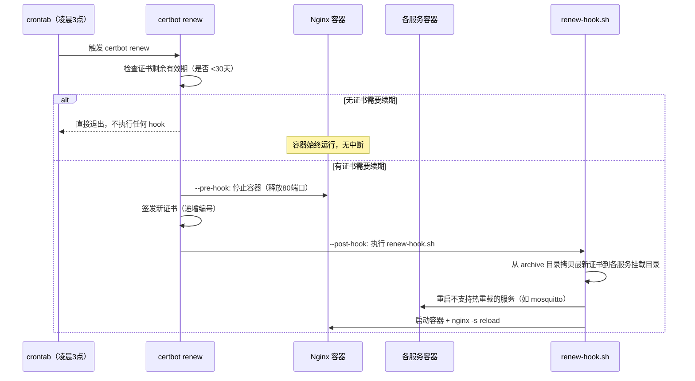

# Docker 环境下 SSL 证书自动续期方案

> [!abstract] 概要
> 本文介绍一种在 Docker 环境下，使用 **certbot standalone 模式 + crontab + hook 脚本** 实现多域名 SSL 证书自动续期的通用方案。适用于一个 Nginx 反向代理容器统一管理多个域名的场景。

---

## 适用场景

你的服务器满足以下条件时，本方案可以直接使用或稍作调整：

- 使用 **Nginx 容器**（或其他反代）作为统一入口，占用宿主机 80/443 端口
- 多个域名通过反向代理分发到不同后端服务
- SSL 证书来自 **Let's Encrypt**，使用 **certbot standalone 模式**签发
- 证书文件需要拷贝到特定目录，供容器挂载使用

## 为什么不用 certbot 官方 Docker 镜像 / webroot 模式？

| 方案 | 问题 |
|---|---|
| certbot 官方 Docker 镜像 | 需要额外容器 + 网络配置，且 standalone 验证仍需宿主机 80 端口空闲 |
| webroot 模式 | 需要修改 Nginx 配置添加 `.well-known/acme-challenge/` 路径，增加维护复杂度 |
| DNS 验证 | 需要提供 DNS API 凭证（如 Cloudflare Token），配置门槛高 |
| **standalone + crontab hook（本文方案）** | 简单直接，续期时临时释放 80 端口，完成后自动恢复 |

## 整体流程



> [!important] hook 的触发时机
> `--pre-hook` 和 `--post-hook` **仅在 certbot 真正发起续签尝试时才会执行**。若所有证书剩余有效期均 > 30 天，certbot 判断无需续签后直接退出，**两个 hook 都不会运行**，网关容器也不会被停止。

**中断时间**：
- 证书未过期时：**不中断**（certbot 跳过续签，不执行 hook，容器全程运行）
- 证书需要续期时：中断约 **5-10 秒**（停容器 → 签发 → 拷贝 → 启动）

---

## 第一步：签发证书（首次）

首次签发需要手动停止占用 80 端口的容器：

```bash fold title:首次签发证书
# 停止占用 80 端口的容器
docker stop <your-gateway-container>

# 签发各域名证书
sudo certbot certonly --standalone -d example1.com
sudo certbot certonly --standalone -d example2.com
sudo certbot certonly --standalone -d example3.com

# 拷贝证书到各服务挂载目录（固定文件名）
# certbot archive 目录使用递增编号（fullchain1.pem → fullchain2.pem → ...）
# 需要拷贝为固定文件名，供容器挂载使用
sudo cp /etc/letsencrypt/archive/example1.com/fullchain1.pem /path/to/service1/ssl/fullchain.pem
sudo cp /etc/letsencrypt/archive/example1.com/privkey1.pem /path/to/service1/ssl/privkey.pem

# ... 对每个域名重复上述操作

# 启动容器
docker start <your-gateway-container>
```

> [!warning] 首次启动会失败
> 如果是新建的 Nginx 容器，首次启动时 SSL 证书尚未签发，Nginx 会因找不到证书文件而启动失败。**这是正常的**——完成证书签发并拷贝到对应目录后，容器即可正常启动。

> [!important] 拷贝 archive 而非 live
> `/etc/letsencrypt/live/` 下的证书文件是软链接，拷贝到其他目录后链接会失效。**必须拷贝 `/etc/letsencrypt/archive/` 目录中的实际文件**。

---

## 第二步：编写续期钩子脚本

脚本的核心逻辑：从 certbot archive 目录取出最新证书，拷贝为固定文件名，然后恢复服务。

> [!tip] 关键技巧
> certbot 每次续期生成递增编号的文件（`fullchain1.pem` → `fullchain2.pem` → ...），脚本通过 `ls -t | head -1` 按时间排序取最新文件，拷贝为固定文件名。这样无论续期多少次，Nginx 配置和容器挂载都不需要改动。

```bash fold title:renew-hook.sh 模板
#!/usr/bin/env bash
set -euo pipefail

LOG_FILE="/path/to/your/renew.log"

# ====== 配置区域：按需修改 ======

# 定义域名与证书存放路径的映射
# 格式：archive源目录 → 目标挂载目录 → 目标文件名前缀
declare -A CERT_MAP
CERT_MAP["/etc/letsencrypt/archive/example1.com"]="/path/to/service1/ssl:fullchain:privkey"
CERT_MAP["/etc/letsencrypt/archive/example2.com"]="/path/to/service2/certs:bundle:key"

# 续期后需要重启的容器（不支持热重载的服务）
RESTART_CONTAINERS=("mosquitto-container" "other-container")

# 需要 reload 的 Nginx 容器
NGINX_CONTAINER="your-gateway-container"

# ====== 执行区域 ======

echo "========================================" >> "$LOG_FILE"
echo "$(date '+%Y-%m-%d %H:%M:%S') - 开始执行续期后处理" >> "$LOG_FILE"

# 1. 拷贝最新证书到各服务挂载目录
for src_dir in "${!CERT_MAP[@]}"; do
    IFS=':' read -r dst_dir fullchain_name privkey_name <<< "${CERT_MAP[$src_dir]}"

    # 按时间排序取最新的 fullchain 和 privkey
    latest_fullchain=$(ls -t "$src_dir"/fullchain*.pem 2>/dev/null | head -1)
    latest_privkey=$(ls -t "$src_dir"/privkey*.pem 2>/dev/null | head -1)

    if [[ -z "$latest_fullchain" || -z "$latest_privkey" ]]; then
        echo "  [SKIP] $src_dir - 未找到证书文件" >> "$LOG_FILE"
        continue
    fi

    cp -f "$latest_fullchain" "$dst_dir/${fullchain_name}.pem"
    cp -f "$latest_privkey" "$dst_dir/${privkey_name}.pem"
    echo "  [OK] $(basename "$src_dir") → $dst_dir" >> "$LOG_FILE"
done

# 2. 启动网关容器
docker start "$NGINX_CONTAINER" >> "$LOG_FILE" 2>&1
sleep 2
docker exec "$NGINX_CONTAINER" nginx -s reload >> "$LOG_FILE" 2>&1
echo "  [OK] $NGINX_CONTAINER 已启动并 reload" >> "$LOG_FILE"

# 3. 重启不支持热重载的容器
for container in "${RESTART_CONTAINERS[@]}"; do
    if docker ps -a --format '{{.Names}}' | grep -q "^${container}$"; then
        docker restart "$container" >> "$LOG_FILE" 2>&1
        echo "  [OK] $container 已重启" >> "$LOG_FILE"
    else
        echo "  [SKIP] $container - 容器不存在" >> "$LOG_FILE"
    fi
done

echo "$(date '+%Y-%m-%d %H:%M:%S') - 续期后处理完成" >> "$LOG_FILE"
```

```bash fold title:使用方法
# 将脚本保存到服务器
chmod +x /path/to/renew-hook.sh
```

---

## 第三步：配置 crontab 定时任务

将续期任务添加到 **root crontab**（certbot 需要 root 权限操作证书文件）：

```bash fold title:配置 crontab
sudo crontab -e
```

添加以下内容：

```cron fold title:crontab 定时任务
# 每天凌晨 3 点执行证书续期检查
# --pre-hook: 续期前停止网关容器（释放 80 端口供 standalone 验证）
# --post-hook: 续期后执行 hook 脚本（拷贝证书、启动容器、reload Nginx）
0 3 * * * certbot renew --quiet --pre-hook "docker stop your-gateway-container" --post-hook "/path/to/renew-hook.sh"
```

> [!note] 为什么用 pre-hook / post-hook 而不是 shell 脚本串联？
> 网关容器占用宿主机 80/443 端口，certbot standalone 验证需要临时监听 80 端口，所以续期前必须停止容器。续期后还需要执行 hook 脚本拷贝新证书并恢复服务。把这两个动作写成 certbot 的 hook，比简单串联 `docker stop && certbot renew && hook` 更清晰，也更安全——certbot **只在实际发起续签尝试时才执行 hook**，证书未到期时容器完全不会被动；如果用 shell 串联，无论是否需要续签都会先停容器，造成不必要的短暂中断。

---

## 第四步：关闭 certbot 自带定时器

certbot 安装包通常会自带的 `certbot.timer`，需要关闭以避免出现两套不一致的续期入口：

```bash fold title:关闭 certbot.timer
sudo systemctl disable --now certbot.timer

# 验证状态
systemctl status certbot.timer          # 应显示 disabled / inactive
systemctl list-timers --all | grep certbot  # 不应有 active timer
sudo crontab -l                         # 应只包含我们配置的凌晨3点任务
```

期望状态：
- `certbot.timer` 为 **disabled / inactive**
- `systemctl list-timers` 中**无** active 的 certbot timer
- `sudo crontab -l` 中**仅有**手动添加的续期任务

---

## 证书管理清单

建议维护一份清单，方便管理所有域名的证书存放位置：

| 域名 | 证书存放位置 | 证书文件名 | 挂载到容器 |
|---|---|---|---|
| `example1.com` | `/path/to/service1/ssl/` | `fullchain.pem` / `privkey.pem` | `nginx-gateway` |
| `example2.com` | `/path/to/service2/certs/` | `bundle.pem` / `key.pem` | `nginx-gateway` |
| `mqtt.example.com` | `/path/to/service3/tls/` | `bundle.pem` / `key.pem` | `mosquitto`（需重启） |

---

## 常见问题

### 证书续期后 Nginx 显示旧证书？

**检查是否拷贝了 archive 而非 live 目录的文件**。`/etc/letsencrypt/live/` 下是软链接，直接拷贝会失效。应拷贝 `/etc/letsencrypt/archive/` 中的实际文件。

### MQTT / 某些服务续期后仍用旧证书？

部分服务（如 mosquitto）**不支持 TLS 证书热重载**，续期后必须重启容器才能加载新证书。在 `renew-hook.sh` 的 `RESTART_CONTAINERS` 数组中添加对应容器名即可。

### DNS 域名指向非本机 IP，standalone 验证失败？

standalone 模式要求域名 A 记录指向本机 IP。如果域名指向 CDN（如阿里云 OSS），需要临时将 DNS 改到服务器 IP，签发成功后再改回。或者改用 certbot DNS 验证模式。

### 查看续期是否成功？

```bash fold title:查看续期日志和状态
# 查看续期日志
cat /path/to/renew-hook.log

# 手动检查续期（dry-run，不会真正续期）
sudo certbot renew --dry-run

# 查看所有证书的到期时间
sudo certbot certificates
```

---

## 实战案例

本文方案的实际应用案例：在 `volcano-honlnk` 服务器上为 5 个域名配置了自动续期，详见 [[honlnk-gateway-deploy-guide#证书自动续期]]。

---

## 参考资料

- [Certbot 官方文档](https://certbot.eff.org/)
- [Certbot renew 命令参考](https://eff-certbot.readthedocs.io/en/stable/commands/renew.html)
- [Let's Encrypt 证书生命周期](https://letsencrypt.org/docs/lifetime/)
