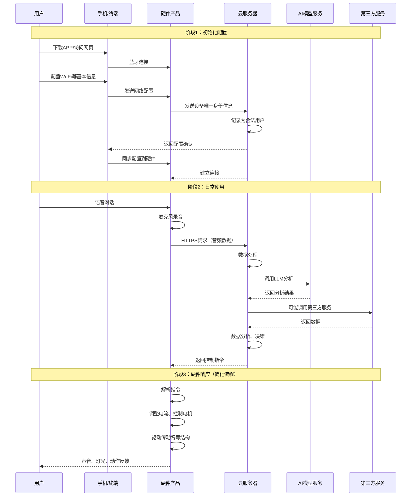

# 智能陪伴硬件产品：商业构想与技术路径探讨

## 背景

与传统彩灯行业从业者讨论产品智能化升级方向。目前拥有：
- 硬件产品生产渠道
- 大型 3D 打印设备
- 景区、庙会等 B 端市场经验

目前不甘心局限于传统彩灯制造，希望拓展产品线，打造智能化产品。

---

## 产品愿景

> "先有一个能保证最基本的对话能力的产品，让产品因为对话、场景或者用户情绪做出一系列的状态变化。"

### 核心能力需求

1. **对话能力**
   - 保证基本的自然语言交互
   - 理解用户意图和情绪

2. **状态变化反馈**
   - 视觉反馈：眨眼、煽动翅膀、彩灯变色
   - 根据对话内容动态调整
   - 响应环境场景和用户情绪

3. **环境感知**（初步设想）
   - 外部环境状态检测
   - 场景识别

---

## 目标用户群体

| 用户群体      | 需求特征 | 产品定位        |
| --------- | ---- | ----------- |
| **老年人**   | 陪伴需求 | 日常陪伴型智能硬件   |
| **单身人群**  | 情感陪伴 | 家居摆件 + 情感交互 |
| **自闭症患者** | 社交辅助 | 治疗性陪伴工具     |

> "陪伴的主体可以抽象成各种各样的实体，不一定非得是人类。"

---

## 产品形态规划

### 1. 智能彩灯系列（B 端升级）
- 景区/庙会彩灯：对话互动 + 动态效果
- 演示：蜻蜓灯对话时翅膀煽动加速

### 2. 家用智能花灯（ToC 高端）
- 质量更高、设计精致
- 摆放场景：家庭环境
- 功能：照明 + 陪伴 + 氛围营造

### 3. 智能玩偶系列
- 各种动物/卡通形象
- 对话交互 + 动作反馈
- 主要面向儿童和陪伴市场

### 4. 成人用品创新方向 ⚠️
- **痛点**：传统情趣用品（飞机杯、硅胶娃娃）用户不愿摆放在家中
- **创新方案**：
  - 小熊玩偶等日常形态
  - 穿着设计遮挡功能性部位
  - 平时作为普通家居摆件
- **目标**：降低用户心理门槛，"没那么情趣的情趣用品"

---

## 技术实现方向

### 硬件层面
- 现有基础：单片机（MCU）
- 升级需求：算力提升、传感器集成
- 生产优势：自有 3D 打印 + 生产渠道

### 软件层面
- **对话能力**：需要接入 LLM 或本地小模型
- **情绪识别**：语音情感分析
- **状态控制**：硬件驱动 + 交互逻辑
- **云端/本地权衡**：成本 vs 响应速度

---

## 商业策略

### 第一阶段策略
- **不组建自研团队**：大部分开发任务外包
- **技术把关人**：招聘 1 名懂技术的人员负责：
  - 外包团队技术审核
  - 防止被坑（成本、质量、技术路线）
  - 进度管理和需求对接

### 风险点
- 外包团队技术能力参差不齐
- 需求沟通成本高
- 知识产权保护
- 长期维护问题

### 外包合作模式

#### 现状
公司目前没有：
- ❌ 自有工厂、硬件开发团队
- ❌ 软件开发公司
- ❌ 专业销售团队

所有核心能力都需要通过外包合作实现。

#### 合作分工

**1. 软件开发外包**
- **责任方**：新招聘的专业软件领域员工
- **职责**：
  - 寻找合适的软件开发外包团队
  - 与外包团队技术交流
  - 完成软件开发任务的对接和协调

**2. 硬件/工厂合作**
- **责任方**：老板或公司其他人员
- **职责**：
  - 利用现有渠道搭线
  - 对接硬件开发团队
  - 协调工厂生产资源

**3. 软硬件交互协调**
- **责任方**：新招聘的专业软件领域员工
- **职责**：
  - 定义软硬件交互接口
  - 确保硬件团队能够配合软件需求
  - 解决集成过程中的技术问题

#### ToC 市场销售（暂定）
- 目前未具体讨论
- 只是暂定目标，不用考虑太远
- 待业务成型后再规划

---

### 未来组织架构规划

#### 第二阶段（业务规模做大后）

**可能组建的团队**：
- ✅ **专业软件开发团队**
- ✅ **嵌入式开发团队**

**不会组建的**：
- ❌ **自有工厂**
  - 原因：成本过高
  - 继续采用外包合作模式

---

## 技术讨论细节

### AI 模型部署方案

#### 现状
- 已在配置不错的电脑上用 Ollama 部署了本地模型
- **问题**：输出速度太慢，无法达到"像豆包那样的响应速度"
- **需求**：极快的响应速度 + 语音输出

#### 我的建议
**必须使用模型公司提供的 API，不要本地化部署**

**理由**：
1. 本地部署要达到"可用"状态，成本极高
2. API 调用成本并没有想象的高
   - 举例：使用 DeepSeek 官网 API 写小说，每天花费很低
3. 响应速度有保障

#### 补充想法（谈话后想到）
- 允许用户自行配置 API Key
- 用户使用自己的额度
- 降低公司运营成本

#### 现状分析
- 公司目前没有懂该方向的员工
- 只是本地部署了模型，没有下一步尝试
- 缺乏技术指导，不知道下一步如何走

---

### 服务器问题

#### 云服务器选择
- **必须租赁云服务器**
- 原因：
  - 没有公网 IP
  - 没有专业维护硬件服务器的人员

#### 服务器维护策略

**他的态度**：
- 必须自己维护（不交由外包团队）
- 不怕招的人少或不专业
- **理由**：
  - 初期几乎不会被任何人注意到
  - 被黑风险极低
  - 退一万步：服务器被黑就不要了，到期自动回收，再买新的

**我的评估**：
- 态度务实，符合初期实际情况
- 但长期看仍需要专业运维能力

---

### 专业名词澄清

#### 概念混淆

**他的理解**：
- 前端 = 灯具等真实物品
- APP/后端 = 用户客户端软件 + 云端服务器软件

**标准定义**：

| 概念 | 他的理解 | 标准定义 | 需要纠正为 |
|------|---------|---------|-----------|
| 前端 | 灯具等硬件产品 | Web/移动应用 | **客户端（Client）**<br>包括：灯具硬件、手机 APP、网页 |
| 后端 | 用户客户端 + 云端软件 | 云端服务 | **服务端（Server）**<br>仅指：云服务器上的软件 |

**纠正后**：
- **客户端（前端）**：用户手中的产品
  - 灯具硬件
  - 手机 APP
  - 网页
- **服务端（后端）**：云服务器上的后端服务

---

### 人机交互详细流程

#### 他的理解（基础版）
```
麦克风接收 → 传给服务器 → 服务器处理 → 返回指令 → 硬件做出反应
```
- 硬件处理器自身不会处理太复杂的问题
- 这个理解已经很优秀了

#### 我的顾虑（关键问题）
- 虽然掌握硬件生产资源
- 但工厂等资源都是外包团队，并非自己的
- **必须让硬件团队开发工程师做出调整**：
  - 单片机主板必须支持联网、蓝牙等功能
  - 必须对外暴露操作硬件的接口
- **否则设想全部是空谈**
- 我是软件工程师，对硬件工程不懂，无法提供有效建议
- 如果可以说通硬件团队，可以从软件开发角度给出建议

---

#### 完整交互流程



#### 详细交互步骤

**阶段 1：初始化配置**
1. 用户下载 APP 或访问网页
2. 使用蓝牙等技术与硬件产品连接
3. 配置基本信息（至少必须联网）
4. 设备唯一身份信息发送到服务器
5. 服务器记录为合法用户
6. 服务器返回数据给手机
7. 手机通过蓝牙将信息存入硬件产品
8. 服务器与硬件产品建立直接连接

**阶段 2：日常使用**
1. 用户对硬件说话
2. AI 麦克风记录音频
3. 通过 Wi-Fi 发送 HTTPS 请求到服务器
4. 服务器内部处理：
   - 数据处理
   - LLM 调用
   - 第三方接口调用
   - 数据分析
5. 服务器返回控制指令

**阶段 3：硬件响应**
1. 硬件内部系统接收指令
2. 调整电流，控制设备：
   - **音响**：直接播放音频
   - **电机等驱动设备**：需要配合传动结构
3. 硬件内部交互：
   - 传动臂等结构设计
   - 这是机械工程领域
4. 最终效果：声音、灯光、动作反馈

#### 技术分层

| 层级 | 包含内容 | 专业知识领域 |
|------|---------|-------------|
| **用户终端软件** | APP、网页 | 软件开发 ✅ |
| **硬件产品** | 单片机主板、传感器 | 硬件工程 ❌ |
| **云服务器** | 后端服务、LLM集成 | 软件开发 ✅ |
| **机械结构** | 传动臂、电机驱动 | 机械工程 ❌ |
| **AI 服务** | 语音识别、LLM、TTS | AI 开发 ✅ |

**注**：✅ 表示可以提供建议，❌ 表示无法提供有效建议

---

*讨论时间：2026-03-06*