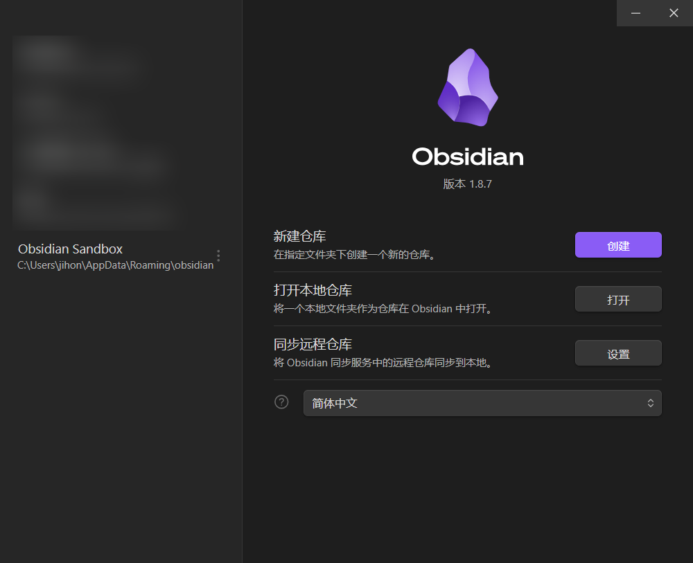
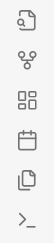
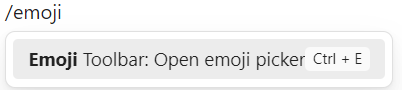
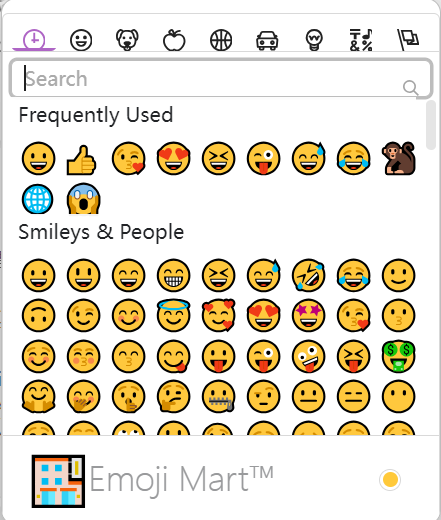

## obsidian是什么
如果你是程序员出身，你可以把他理解为一个专门处理纯文本笔记的vscode。

Obsidian 是一款**本地优先**的**知识管理工具**，专为构建个人知识体系设计。核心特点包括：
1. **Markdown 为核心** - 基于纯文本标记语言，支持完整语法扩展
2. **网状知识链接** - 双向链接+关系图谱，可视化呈现知识关联
3. **模块化扩展** - 类似 VSCode 的插件生态（200+ 官方/社区插件）
4. **完全可控** - 数据以标准 Markdown 格式本地存储，支持 Git 版本管理
5. **跨平台支持** - 全平台覆盖（Win/Mac/Linux/Android/iOS）

## 为什么使用obsidian
1. **支持完整的markdown语法**
	在markdown官网能够看到的语法在这里全部可以使用，此外还有obsidian自定义的一些语法结构，让我们写作更简单。
2. **白板**（CANVAS）
	白板功能，可以将用户的：纯文本，笔记，图片，网站等信息放在同一个面板中，更加方便用户查看和编辑资料，如果是大屏，体验会非常舒适。
3. **文件双向连接，构建关系图谱**
	- obsidian中的文件链接，支持双向跳转，也就是说，即便是被链接方也可以轻松的跳转到链接他的位置，方便用户根据笔记关系查看笔记。
	- 可以一键生成笔记的关系图谱，结合更多功能，可以轻松的构建出自己的知识图谱。
4. **多端同步**
	多端同步可以分为两种：
	- 官方提供的多端同步，但是需要开通商业版，每个月20美刀。
	- 通过git仓库，实现多端同步，在插件库中提供了一个名叫：`obsidian-git`的插件，通过简单的配置即可实现多端同步文档。
2. **集成AI**
	在AI快速发展的今天，obsidian的插件库中存在多个大佬开发的AI插件，提供的功能多种多样，供用户任意选择，只需要经过简单的配置，即可实现在obsidian无痛使用AI，还可以搭建属于自己的知识库。
3. **编写数学公式**
	支持编写LaTeX数学公式，可以在笔记与AI对话之间无痛交互，学习数学的用户可以结合集成在obsidian中的AI，编写数学笔记，实现无纸化学习。
4. **支持自定义样式**
	在obsidian中可以通过编写一些配置文件，将obsidian中默认的样式换成用户自己喜欢的样式。
5. **灵活的笔记仓库**：
	在obsidian中，一个文件夹就可以是一个仓库，文件夹（仓库）的地址可以由用户自己决定。
	多个仓库之间的配置可以互不干扰。
	允许仓库嵌套仓库。
6. 更多你想得到，想不到的功能，在obsidian中都可以实现。
## 安装
**官方网站下载**：[http://obsidian.md/download](http://obsidian.md/download)
***百度网盘下载***：[https://pan.baidu.com/s/1RnBGVQPqJNv0btpKNZYLIA](https://pan.baidu.com/s/1RnBGVQPqJNv0btpKNZYLIA) 提取码: hy16

通过官网下载的前提是你可以科学上网，如果不能。推荐使用我提供的百度网盘中的安装包或者去其他平台进行下载。
obsidian官方支持五种操作系统：`Android` `iOS` `Windows` `Linux` `MacOS`，纯血鸿蒙或许还没有兼容，据[网友](https://www.zhihu.com/question/592024886/answer/2958457809)所说直接使用APK安装包或者在`pureapk`平台可以下载，在但是作者本人并没有华为手机，所以无法验证，还请鸿蒙用户自行测试。

## 基本使用
在使用obsidian之前，需要熟悉obsidian中的一些简单操作。
### markdown语法
使用obsidian，markdown是必须要会的，因为这就是一个基于markdown的文本编辑器。
#### 什么是markdown
> [! info] 维基百科
> Markdown 是一种轻量级标记语言，用于使用纯文本编辑器创建格式化文本。John Gruber 在 2004 年创建了 Markdown，作为一种易于阅读的标记语言。  Markdown 广泛用于博客和即时通讯，也用于在线论坛、协作软件、文档页面和自述文件中的其他地方。

Markdown 是一种轻量级标记语言，通过简单的纯文本符号（如 `#` `*` `-`）来实现标题、列表、链接等排版格式。它可以用普通文本编辑器编写，并能轻松转换为HTML等格式，特别适合快速书写和网络内容创作。
#### 学习markdown
你可以选择再两种
markdown中文文档：[https://markdown.com.cn/basic-syntax/](https://markdown.com.cn/basic-syntax/)
markdown官方文档：[https://www.markdownguide.org/](https://www.markdownguide.org/)
#### 语法简单说明
1. **标题**：`# 一级标题` `## 二级标题`（最多支持六级）
2. **列表**：
   - 无序列表：`- 项目` 或 `* 项目`
   - 有序列表：`1. 项目`
3. **链接**：`[显示文本](链接地址)`
4. **图片**：``（Obsidian支持直接拖放插入）
5. **引用**：`> 引用内容`
6. **代码块**：``` 代码 ```（支持语法高亮）
7. **强调**：
   - *斜体*：`*文字*` 或 `_文字_`
   - **加粗**：`**文字**`
   - ***加粗倾斜***：`***文字***`
8. **分割线**：三个及以上`---`或`***`
### obsidian基础控件

#### 初始化仓库
软件安装完成之后，会打开这样一个界面

项目安装完成之后一般可以看到一个项目默认自带的仓库，里面的内容与本文档相似，是一个全英文的对obsidian的介绍，有兴趣的朋友可以打开查看。
> [! WARNING] 警告
> 这是一个**沙箱仓库**，用户在里面所作的内容全部**不会被保存**
> 所以，用户只能在里面做一些测试
> 想要记录笔记的话，需要用户自己单独创建一个仓库

##### 首次创建仓库
> [! info] 官方文档
> In Obsidian, a vault is a plain folder on your computer. By plain, I mean it's just like a folder you created and put some files in. You can open it with your system explorer or Finder, zip it up, make a copy, or move it around.
> 正如官网说的那样：obsidian仓库就只是本地的一个文件夹

只需要四部即可创建一个obsidian仓库：
1. 单击 “创建”按钮
	打开创建仓库面板
	
2. 输入你想要的仓库名字
	这里可以输入任意符合文件夹要求的字符
	文件名不能包含下列任何字符：`V` `/` `:` `*` `?` `"` `<` `>` `|`
3. 选择你想存储此仓库的位置。
	- 推荐将文档存入一个非C盘的位置
	- 推荐奖所有的markdown文档统一管理，比如在D盘下创建一个名叫：`markdownStore`的文件夹，然后将所有的markdown仓库存入这个文件夹
4. 单击 “创建”按钮。

##### 首次打开仓库

> [! note]- 管理仓库建议（来自本文作者的使用经验）
> 理论上，任意一个文件夹都可作为obsidian的一个仓库打开。
> 你甚至可以打开一个已经存在的仓库中的任意一个文件夹，作为你的新的仓库。
> 也就是说，你可以创建一个嵌套的仓库。
> 推荐创建一个总的仓库，然后逐级管理一些小的仓库，
> 这样做的好处是：
> - 可以分情况部署插件以及定制化的设置
> - 可以统一查看文件与文件之间的关系
> 	- 可以只为数学库中部署LaTeX Math插件，方便我编写数学公式。
> 	- 可以只在项目笔记库中部署AI插件，方便我学习，记录开发中学到的知识
> 比如笔者我的仓库结构：
> - honlnk
> 	- 项目笔记
> 		- 项目1 笔记
> 		- 项目2 笔记
> 	- 博客
> 		- obsidian基本使用文档
> 		- 。。。
> 	- 英语
> 		- 语法
> 		- 阅读
> 	- 数学
> 		- 错题
> 		- 笔记

打开仓库的步骤只需要一步：在打开本地仓库管理页面中 单击`打开本地仓库` 拦的 “打开”按钮，选择你想打开的文件，即可将这个文件作为一个新的仓库打开。

##### 再次新建 | 打开仓库
用户只需要单击页面左下角的仓库名

在弹出的列表中单击 管理仓库按钮，即可打开前文中提到的“仓库管理页面”，打开这个页面，剩余的步骤与首次新建 | 打开步骤相同

#### 基本操作
##### 左侧面板基本操作
 
 以上五个控件分别为：
 1. 收起 | 展开 左侧面板
 2. 文件列表：文件树，可以对库中的文件进行新增、删除、移动、重命名等操作
 3. 搜索：在库中全局搜索，你需要的信息
 4. 书签
 5. 标签
	 - **什么是标签**：标签一般情况是跟在某些内容后方的一个标记，语法一般是在内容后方拼接一个 `#标签内容`
		``` markdown
		### 这是一个二级标题 #二级标题的标签
		内容1
		内容2
		内容3 #内容3的标签
		```
	- 这个控件在默认的设置中可能是在右侧边栏中，我因个人喜好，将其移至左侧。
		移动方法：鼠标单击拖动即可完成移动

---
##### 右侧面板基本操作

以上四个控件分别为：
1. 收起 | 站看右侧面板
2. 文档的反向链接：用来查看在哪些文档的内容中**引用了当前文档**
3. 文档的链接：用来查看当前文档中**引用了哪些文档中的内容**
4. 大纲

---
##### 文件列表面板基本操作

以上五个控件分别为：
1. 新建笔记：
	- 新增一个markdown文件
	- 默认快捷键：**`Ctrl+N`**，可在设置中修改此设置
	- 默认存储位置为文件根目录，可在设置中[修改此设置](#新建笔记存放位置)。推荐将其设置为：**存储在当前文件所在文件夹**
		`设置` >`选项` > `文件与链接` > `新建笔记的存放位置`，在右边的选项卡中选择`当前文件所在的文件夹`。
	- 其他操作：在文件夹处右击鼠标（如果是移动端，则长按），选择`新建笔记`
2. 新建文件夹：
	与新建笔记类似，在根目录下创建一个文件夹，不过似乎不能进行设置。
3. 排序：
	对obsidian仓库中的文件进行默认排序，默认：文件名（A-Z）。
4. 自动显示文件（Auto-reveal current file）：
	当启用该功能后，在切换不同笔记时，文件列表会自动跟随显示当前文件位置，避免手动在文件树中寻找当前文件。
	**推荐启用此选项**
5. 全部折叠|全部展开

##### 左侧快捷菜单基本操作

以上6个控件中分别为：
1. 打开快速切换
	- 默认快捷键：`Ctrl + o`
	- 在 “快速切换面板” 可以不通过文件树列表，跳转切换文件，mac-OS用户可能非常喜欢。
2. 查看关系图片
	- 默认快捷键：`Ctrl + g`
3. 新建白板
4. 打开/创建今天的笔记
5. 插入模板
	- 可在设置中设置模板的 模板位置、日期格式、时间格式
6. 打开命令面板：
	- 默认快捷键：`Ctrl + p` 
	- 在 ”命令面板中“ 可以直接输入命令，对文档进行操作，mac-OS用户可能非常喜欢。
## 进阶设置

> [! TIP] 提示
> 以下设置，均根据本文笔者的使用习惯提供建议，如果你不想接受建议，这一章可以跳过 🐒

### 编辑器设置

#### 拼写检查
设置 > 选项 > 编辑器 > 行为 >  拼写检查语言，添加你需要检查的语言，比如：`English`、`English（Australia）`
#### Vim模式
> [! ERROR] 警告
> 没有vim使用经验的用户不要轻易尝试，除非你有学习vim的计划

熟悉使用Vim编辑器的，还可以在设置中打开Vim模式，obsidian已经支持了Vim的操作
设置 > 选项 > 编辑器 > 高级 > Vim 模式，打开开关

### 文件与链接

#### 确认删除提示
删除文件时，一般会有一个确认删除的弹框，如果讨厌这个弹框，可以考虑将其关闭。
推荐选择默认，不关闭。以防止误删除
设置 > 选项 > 文件与链接 > 确认删除提示。

#### 删除文件设置
如果是非windows操作系统，推荐将其设置为：`移至软件回收站（.trash文件夹)`
windows用户任意
设置 > 选项 > 文件与链接 > 删除文件设置。在右边的选项卡中选择 ”`移至软件回收站（.trash文件夹)“

#### 链接相关设置
1. **Wiki链接**：自动导入链接时，默认的链接格式
	- Wiki链接虽然有很多优点，比如：它允许用户快速创建指向其他笔记的链接，而不需要输入完整的路径或文件名扩展名。但是 Wiki链接，**并不是标准的Markdown语法**，有些markdown可能不能识别这种格式。
	- 所以自动导入链接时，建议**不使用默认的Wiki**。
	- 设置 > 选项 > 文件与链接 > 使用Wiki链接，将开关关闭。
2. **内部链接类型**：自动导入链接时，默认的链接类型为尽可能短的形式
	- 对于文件量过大的仓库使用尽可能短的形式或许并不是一个好的选择，因为**有文件重名的可能**。
	- 推荐将其修改为”**基于当前笔记的相对路径**“，这更有利于文件间关系的管理。
	- 设置 > 选项 > 文件与链接 > 内部链接类型，在右侧选项卡中选择”`基于当前笔记的相对路径`“
3. **始终更新内部链接**：链接根据文件的变化自动调整。
	- 被链接的文件位置、文件名等信息发生改变时，链接它的链接也会自动发生改变。
	- 开启这个功能的**前提**是，要将内部链接类型修改为：`基于当前笔记的相对路径`，以**防止误修改**的事故出现。
	- 设置 > 选项 > 文件与链接 > 始终更新内部链接，将开关开启。
4. **附件默认存放的路径**：附件自动导入时文件默认存放的位置
	- 附件自动导入时，文档中会自动添加一条连接，连接的位置即为附件存放的路径。
	- 推荐将其设置为：**”当前文件所在文件夹下指定的子文件夹“**，这更有利于文件管理。
	- 选择完成之后会多出一条配置项：”**子文件夹名称**“，这里建议**动态设置**，在编写不同种类的文本时，将此文件夹命名为不同的名字。比如本文档，我在编写时会涉及到大量的图片，我导入最多的附件就是图片，我会将子文件夹设置为 `image`。用来存储文件中链接的图片。
	- 设置 > 选项 > 文件与链接 > 默认存放路径(设置为：当前...子文件夹) > 子文件夹名称(文本框中输入：image)
5. ***总结***：
	1. 关闭使用Wiki链接选下昂
	2. 内部链接类型设置为：基于当前笔记的相对路径
	3. 开启始终自动更新内部链接选项
	4. 附件默认存放的路径设置为：当前文件所在文件夹下指定的子文件，子文件名推荐根据笔记类型动态设置。
#### 新建笔记存放位置
> [! WARNING] 提示
> - 就文档成文日期来看（2025年2月25日），新建白板以及新建文件夹，是不可以设置默认路径的，默认都是存储在根目录下。
> - 但是可以通过在文件夹处右击 选择新建的方式 在指定的文件夹下创建新的文件夹或者白板

设置 >选项 > 文件与链接 > 新建笔记的存放位置，在右边的选项卡中选择”**当前文件所在的文件夹**“。
#### 检测所有类型文件
如果你有在obsidian中，查看obsidian默认不支持的，文本文件格式的需求。
比如你想临时在obsidian中修改一个python文件，你可以将这个选项打开。即可查看修改这个文件
设置 > 选项 > 文件与链接 > 检测所有类型文件，打开开关。

### 核心插件
#### 斜杠命令
斜杠命令对于一些不懂markdown语法的小白来说是非常友好的插件，可以直接以斜杠开头，输入命令，即可完成一些设置
比如想插入一个链接：直接在文本中输入 `/链接`，你就可以得到这样一个下拉列表，选择你想插入的链接类型即可。


### 快捷键
设置 > 选项 > 快捷键

关于快捷键，用户可以根据自己的喜好设置快捷键，对于 笔者而言，更喜欢与后文中要讲到的插件，一起使用。
比如：我有一个Emoji插件，如果我想添加一个笑脸😀，我有很多中操作可以选择
1. 使用前文中提到的斜杠命令 输入 `/emoji`，我就可以得到一个下拉列表，选择插件选项，即可打开一个选择表情的对话框
	-  
	- 
2. 我还可以打开"命令面板"，在搜索框中输入emoji，然后打开对话框
3. 我可以自定义一个快捷键，比如：`Ctrl + E`
	如果`Ctrl + E` 以及有了指定的指令，我会判断这个这个指令重不重要，如果不重要，我会毫不犹豫的将其替换为打开Emoji的插件。